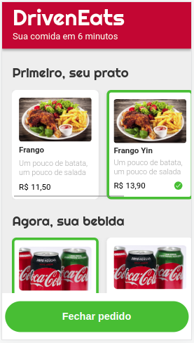

   

DrivenEats é um projeto que reproduz a interface de um aplicativo de delivery de comida.

Suas principais funções são:
- Exibir um cardápio (um pouco limitado, é verdade hahaha) com opções de prato, bebida e sobremesa.
- Permitir que o usuário envie seu pedido para o restaurante pelo whatsapp com uma mensagem de resumo do pedido e o valor total da compra

Para executar esse projeto na sua máquina basta abrir no navegador o arquivo index.html, que está na raiz do projeto.
Simples assim, não precisa instalar nenhuma biblioteca e nem fazer configurações.

Você pode adicionar um número de whatsapp real na linha 4 do arquivo script.js, que também está na raiz do projeto, se quiser testar a aplicação até a etapa de envio da mensagem.
Caso opte por não fazer isso, a aplicação funcionará normalmente, apenas não enviará a mensagem final para o restaurante imaginário.

As tecnologias utilizadas nesse projeto foram:
- HTML5
- CSS3
- Javascript
